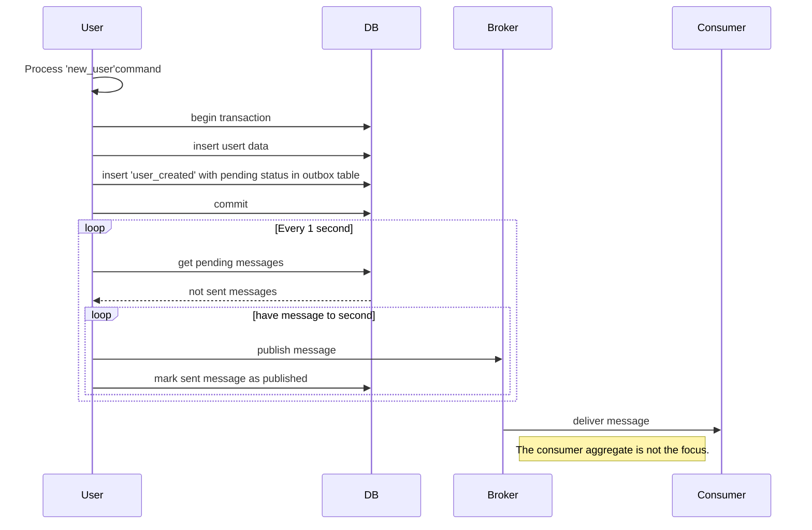
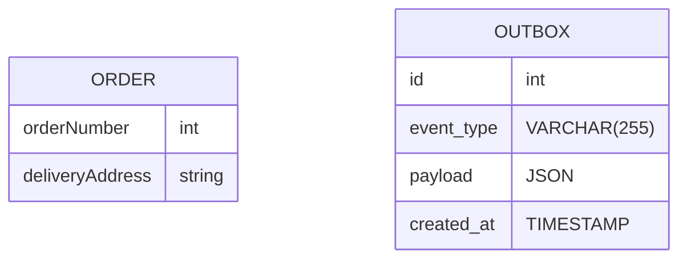

# The Outbox Pattern

The Outbox Pattern is indeed a valuable technique in distributed systems architecture, particularly in microservices environments, to ensure reliable event publishing. By persisting events in an "Outbox" table within the microservice's database, it decouples the act of generating events from the act of publishing them, thereby providing better fault tolerance and reliability.

Here's a breakdown of how the Outbox Pattern works:

1. **Event Generation**: When something significant happens within a microservice that needs to be communicated to other parts of the system or other microservices, instead of immediately publishing an event, the microservice first records this event in its local database.

2. **Outbox Table**: The events are stored in an "Outbox" table, usually within the microservice's own database. This table contains records representing the events that need to be published.

3. **Transactional Integrity**: Importantly, the act of persisting the event to the Outbox table occurs within the same database transaction as the business operation that triggered the event. This ensures transactional integrity, meaning that either both the business operation and the event persist or neither does, preventing inconsistencies.

4. **Periodic Publication**: Separately, there is a background process or a scheduled job within the microservice that periodically checks the Outbox table for new events. This process is responsible for publishing these events to the message broker or event bus.

5. **Publishing to Message Broker**: Once the events are picked up from the Outbox table, they are published to the message broker or event bus. From there, they can be consumed by other microservices or components in the system.

By following this pattern, you ensure that events are reliably published even in the face of failures. If the publishing process fails for some reason (e.g., network issues, message broker downtime), the events remain safely stored in the Outbox table, ready to be retried later when the system is back to normal.

## Sequence diagram

This sequence diagram outlines the steps involved in processing a "new_user" command, including database transactions, event publishing to a message broker, and message delivery to a consumer. The Outbox Pattern is utilized to ensure reliable event publishing by initially inserting events into an outbox table in the database, and then periodically checking and publishing pending messages to the broker. Once the messages are successfully delivered, they are consumed by the appropriate consumer.



## Why we use this Outbox Pattern ?

The Outbox Pattern is particularly beneficial in scenarios where data consistency and accuracy are paramount, especially in critical systems dealing with financial transactions or other sensitive data. Here are some key reasons why the Outbox Pattern is used:

1. **Atomicity**: By ensuring that database updates and event publishing occur within the same transaction, the Outbox Pattern guarantees atomicity. This means that either both the database update and the event publication succeed, or neither does, maintaining data consistency.

2. **Reliability**: The Outbox Pattern enhances the reliability of event publishing by decoupling it from the main business logic. Even if there are failures during the event publishing process, events remain safely stored in the Outbox table until they can be successfully published later, minimizing the risk of data loss.

3. **Data Integrity**: In critical systems where accurate and consistent data is crucial, the Outbox Pattern helps maintain data integrity. It ensures that all relevant events are captured and processed correctly, preventing discrepancies or data loss.

4. **Resilience**: By separating event generation from event publishing, the Outbox Pattern improves system resilience. It allows the system to recover from failures gracefully, ensuring that no events are missed or overlooked even in the face of network issues, system crashes, or other failures.

5. **Scalability**: Adopting the Outbox Pattern facilitates the scalability of event-driven architectures. It allows for better handling of larger request volumes and enables faster time-to-market by providing a robust mechanism for reliably processing and distributing events across distributed systems.

## Scenario 
Let's consider an example of an e-commerce system where orders are placed and processed. In this scenario, we'll implement the Outbox Pattern to ensure reliable event publishing related to order processing. 

Suppose we have a microservice responsible for managing orders. When a new order is placed, an event needs to be published to notify other parts of the system about the new order. Instead of directly publishing this event, we'll use the Outbox Pattern.

```plantuml
rectangle Outbox {
    :User: as User
    User --> Microservice : "Add / Change"
    rectangle Order as Microservice #lightgreen {
        rectangle "REST API" as REST #red
        rectangle Publisher #orange 
        REST -right->> Publisher
    }
    rectangle "Payment topic broker" as EventBus #gray
    Publisher -right->> EventBus
    rectangle Database #lightgreen {
        rectangle Entity #blue
        rectangle  OUTBOX #orange
    }
    
    REST --> Entity : Transaction
    REST --> OUTBOX 
    Publisher --> OUTBOX : "Read, Delete"
}
```

Here's how the Outbox Table might look like in a simplified form:


```sql
CREATE TABLE Outbox (
    id INT AUTO_INCREMENT PRIMARY KEY,
    event_type VARCHAR(255) NOT NULL,
    payload JSON NOT NULL,
    created_at TIMESTAMP DEFAULT CURRENT_TIMESTAMP
);
```
In this example:

- **id**: An auto-incremented unique identifier for each event record in the Outbox table.
- **event_type**: Indicates the type of event being stored. For instance, it could be "OrderPlaced", "OrderUpdated", "OrderCancelled", etc.
- **payload**: Contains the data associated with the event. This could include information about the order, such as order ID, customer details, products, etc., serialized in JSON format.
- **created_at**: Represents the timestamp when the event was recorded in the Outbox table.

## Overall

1. The Outbox Pattern enhances the resilience and reliability of event-driven architectures in distributed systems by decoupling event generation from event publishing and ensuring transactional integrity.

2. The Outbox Pattern plays a crucial role in building resilient, reliable, and scalable systems, especially in environments where data consistency and accuracy are paramount. By implementing this pattern, organizations can ensure that their systems meet the stringent requirements of critical business processes while also accommodating rapid business adaptations and evolving market demands.

## Videos

 * [Reliably Save State &amp; Publish Events (Outbox Pattern)](https://www.youtube.com/watch?v=u8fOnxAxKHk)
	> [](https://www.youtube.com/watch?v=u8fOnxAxKHk "Reliably Save State &amp; Publish Events (Outbox Pattern) by CodeOpinion 23,840 views 9 minutes, 10 seconds")
 * [Alternative to the Outbox Pattern? Not so fast.](https://www.youtube.com/watch?v=cuQ9zuNF1cI)
	> [](https://www.youtube.com/watch?v=cuQ9zuNF1cI "Alternative to the Outbox Pattern? Not so fast. by CodeOpinion 16,225 views 9 minutes")

## References

1. [Outbox-Pattern-Example](https://github.com/victorhsr/Outbox-Pattern-Example/tree/master)
2. [[MICROSERVICES] Outbox Pattern](https://medium.com/@victorhsr/microservices-outbox-pattern-a4344d8ed0b)
3. [Outbox Pattern(Saga): Transações distribuídas com microservices](https://medium.com/tonaserasa/outbox-pattern-saga-transa%C3%A7%C3%B5es-distribu%C3%ADdas-com-microservices-c9c294b7a045)
4. [outbox-pattern-for-microservices-architectures](https://medium.com/design-microservices-architecture-with-patterns/outbox-pattern-for-microservices-architectures-1b8648dfaa27)
5. [transactional-outbox](https://microservices.io/patterns/data/transactional-outbox.html)